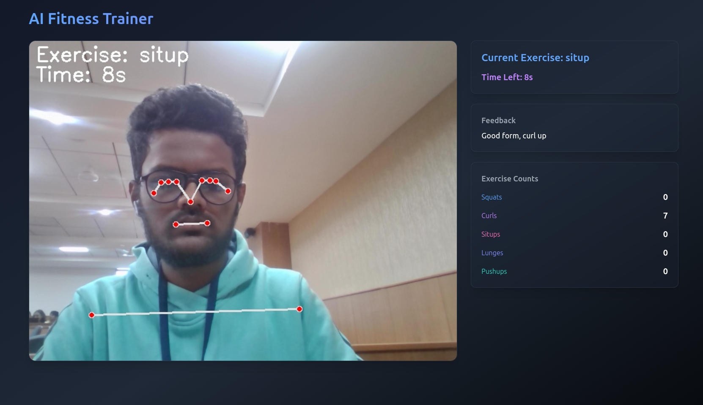
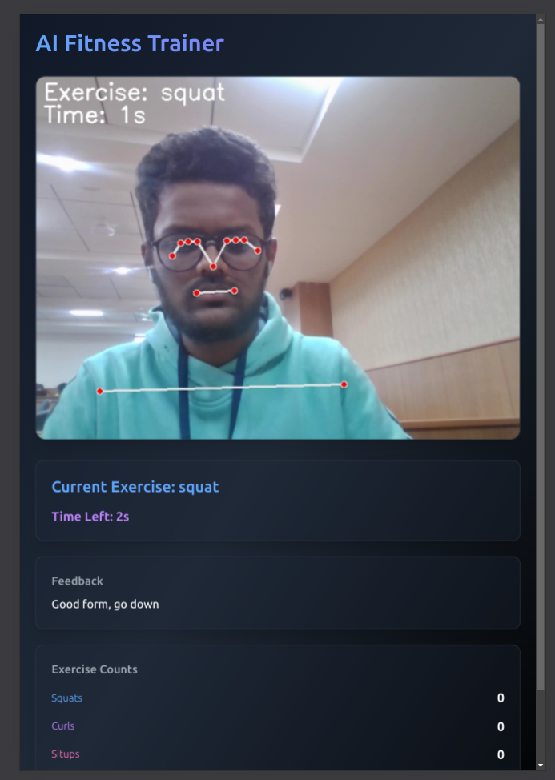
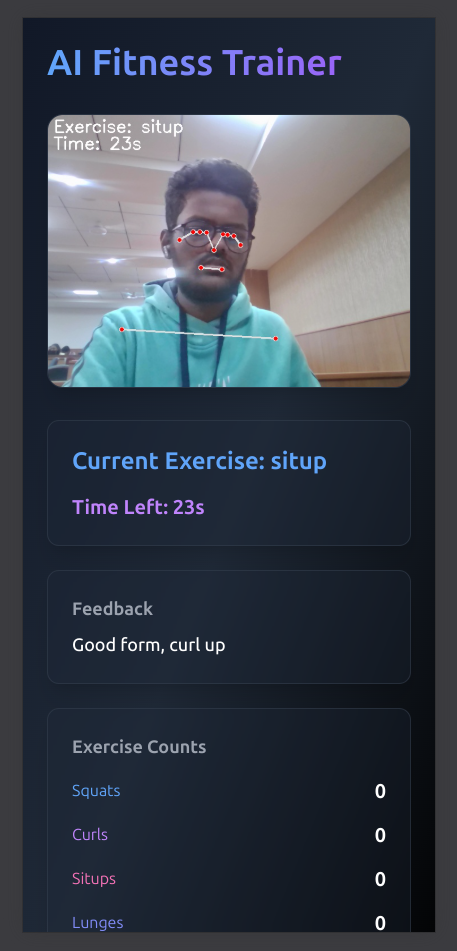

# 💪 AI Fitness Trainer 🏋️‍♀️

## 🌟 Overview
AI Fitness Trainer is your personal digital workout companion that transforms your exercise routine using cutting-edge computer vision technology! Track your movements, count reps, and receive real-time feedback with this smart fitness app.

## 💻 UI




## 🚀 Tech Stack
[](#)
[](#)
[](#)
[](#)

## ✨ Features
- 📹 Real-time video feed with exercise tracking
- 💯 Multi-exercise Support:
  - 🏋️ Squats
  - 💪 Curls
  - 🧘 Situps
  - 🏃 Lunges
  - 💥 Pushups
- 🔄 Automatic exercise progression
- 🔢 Precise repetition counting
- 💬 Instant form feedback
- ⏱️ Time-based exercise sessions

## 🛠️ Prerequisites
- 🐍 Python 3.8+
- 📸 Camera-enabled device

## 🚦 Quick Start
1. Clone the repository:
```bash
git clone https://github.com/Builder-Byte/4_brAInwaves_healthandwellness.git
cd 4_brAInwaves_healthandwellness
```
2. Create a virtual environment:
```bash
python -m venv venv
source venv/bin/activate  # On Windows, use `venv\Scripts\activate`
```
3. Install dependencies:
```bash
pip install -r requirements.txt
```
4. Launch the fitness trainer:
```bash
python exercise.py
```
5. Open your browser and start your workout at `http://localhost:5000` 🏃‍♂️💨

## 🤖 How It Works
Our AI magic uses MediaPipe's pose estimation to track your body landmarks with laser-like precision. Each exercise has a smart algorithm that counts reps based on your body's unique angles and positions.

## 💪 Supported Exercises
- **Squats**: Knee and hip angle wizardry
- **Curls**: Elbow and shoulder angle tracking
- **Situps**: Shoulder, hip, and knee coordination analysis
- **Lunges**: Hip, knee, and ankle movement detection
- **Pushups**: Shoulder, elbow, and wrist angle perfection

## 🚧 Workout Limitations
- 💡 Needs good lighting
- 👀 Best with full-body visibility
- 📸 Accuracy depends on camera quality

## 🤝 Join the Fitness Revolution
Got ideas to make this even more awesome? Pull requests are welcome! Let's get fit together! 💥

## 🏆 Created By
[Builder-Byte Team](https://github.com/Builder-Byte)

## 📜 License
MIT License

---
**Made with ❤️ and 🧠 by the brAInwaves Team**
